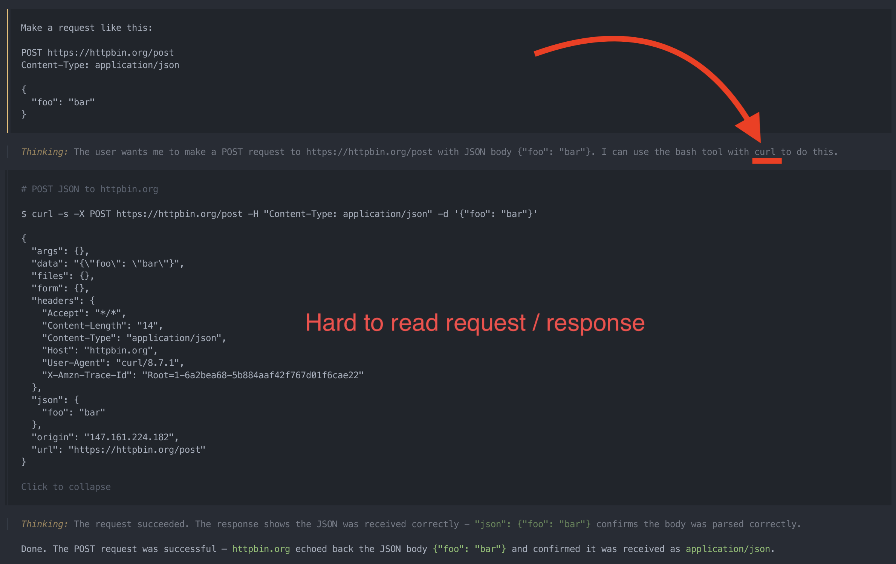
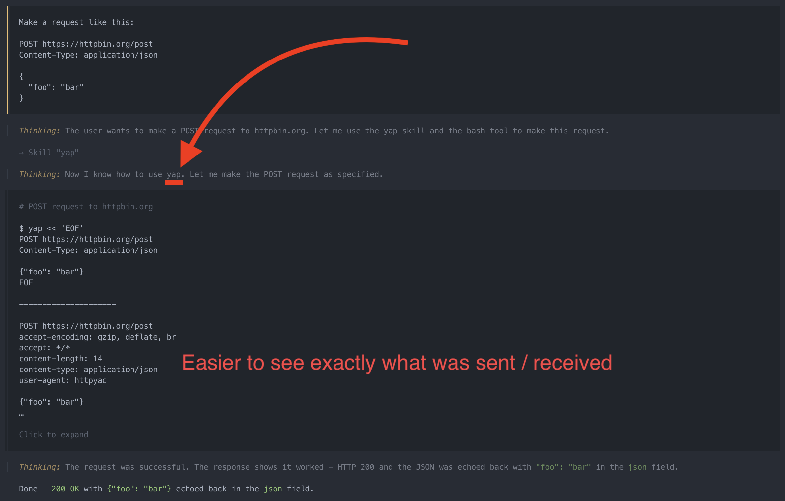

# httpyap

Pipe `.http` file syntax to [httpyac](https://httpyac.github.io/) via stdin.


## Agentic use

The main use case of httpyap is teaching agents how to make readable requests, otherwise they tend to prefer to use curl

Why http syntax is better than curl:

- Curl acts different between operating systems
- Http is prettier ✨

### Without the yap skill



### With the yap skill



## Installation

Requires Node.js 18+. Install directly from GitHub:

```sh
npm install -g github:harvzor/httpyap
```

To uninstall:

```sh
npm uninstall -g httpyap
```

### Get the skill

A agent skill is available, teaching AI agents how to use `yap`. Install it with the [`skills` npm tool](https://www.npmjs.com/package/skills):

Install globally (recommended - keeps skills out of individual project repos):

```sh
npx skills add git@github.com:harvzor/httpyap.git -g
```

Or install into the current project only:

```sh
npx skills add git@github.com:harvzor/httpyap.git
```

## Usage

### Interactive

Type `yap`, paste your request, then type `###` on its own line and press Enter to send:

```sh
$ yap
Paste your .http request, then type ### to send:
GET https://httpbin.org/json
###
```

### Piped

#### Bash

```bash
echo "GET https://httpbin.org/json" | yap
```

Multiline:

```bash
yap << 'EOF'
POST https://httpbin.org/post
Content-Type: application/json

{
  "foo": "bar"
}
EOF
```

#### Zsh

```zsh
echo "GET https://httpbin.org/json" | yap
```

Multiline:

```zsh
yap << 'EOF'
POST https://httpbin.org/post
Content-Type: application/json

{
  "foo": "bar"
}
EOF
```

#### PowerShell

```powershell
"GET https://httpbin.org/json" | yap
```

Multiline:

```powershell
@"
POST https://httpbin.org/post
Content-Type: application/json

{
  "foo": "bar"
}
"@ | yap
```

#### Nushell

```nushell
"GET https://httpbin.org/json" | yap
```

Multiline:

```nushell
'POST https://httpbin.org/post
Content-Type: application/json

{
  "foo": "bar"
}' | yap
```

### Using variables

#### Via .env files

Yac supports `.env` files via httpyac's variable resolution. Place a `.env` file in the working directory and reference variables using `{{name}}` syntax in your request:

```ini
# .env
token=my-secret-token
baseUrl=https://httpbin.org
```

```powershell
@"
GET {{baseUrl}}/json
Authorization: Bearer {{token}}
"@ | yap
```

#### Inline variables

Variables can be defined inline in the request using `@name = value`:

```powershell
@"
@token = my-secret-token

GET https://httpbin.org/json
Authorization: Bearer {{token}}
"@ | yap
```

## Output

Displays the full request/response exchange with syntax highlighting, matching httpyac's default output format.

